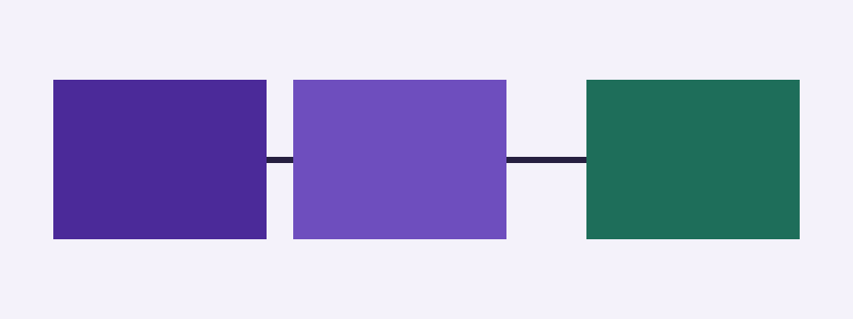

# Writing pages

Every page is a Markdown file under `docs/`. A `README.md` or `index.md` in a folder is that folder's page, and `docs/README.md` is the home page. Without a title in the front matter a page takes its first heading.

## Front matter

| Key           | Meaning                                         |
| ------------- | ----------------------------------------------- |
| `title`       | The page title, also used by search.            |
| `nav_title`   | A shorter title for the sidebar.                |
| `description` | One sentence, used by search and link previews. |
| `order`       | A number: the sidebar sorts by it, then title.  |
| `updated`     | The date of the last substantial change.        |
| `tags`        | A list of words shown under the title.          |

## Callouts

The five GitHub alerts become callouts, and GitHub renders the same Markdown:

> [!NOTE]
> Useful context for the reader.

> [!TIP]
> A better way to do the same thing.

> [!IMPORTANT]
> Something the reader needs to know.

> [!WARNING]
> Something that can go wrong.

> [!CAUTION]
> Something that cannot be undone.

## Links

Write links the way GitHub wants them, relative to the file: [install](install.md#check-it), [the commands](../reference/commands.md) or [the home page](../README.md). The build turns them into page addresses and fails if one points nowhere.

A link to a file of the repository outside `docs/` becomes a link to that file on GitHub, such as the [Worker](../../src/worker.ts#L5), and a link to a folder becomes a link to the folder, such as [src](../../src).

## Images

An image inside `docs/` is published with the site:



An image elsewhere in the repository is loaded from GitHub, like this logo: 

## Code

Fenced code is highlighted by language and comes out exactly as written.

```typescript
export default {
  async fetch(request: Request): Promise<Response> {
    return new Response(`Hello from ${new URL(request.url).pathname}`);
  },
};
```

```yaml
on:
  pull_request:
    paths: ["docs/**"]
```

```json
{ "name": "docusystem-example-docs", "private": true }
```
